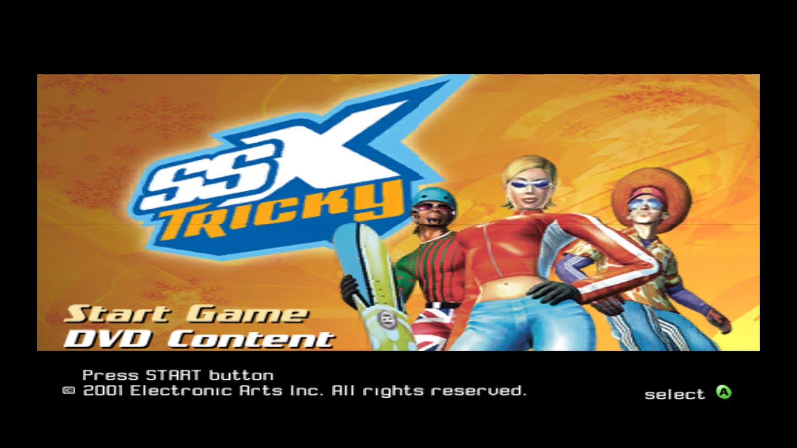
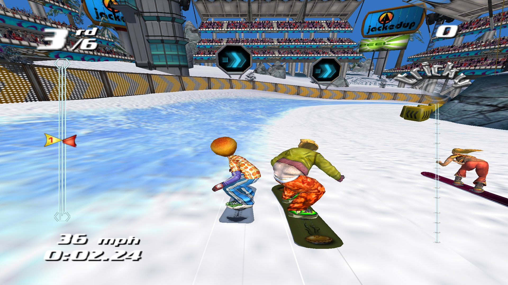
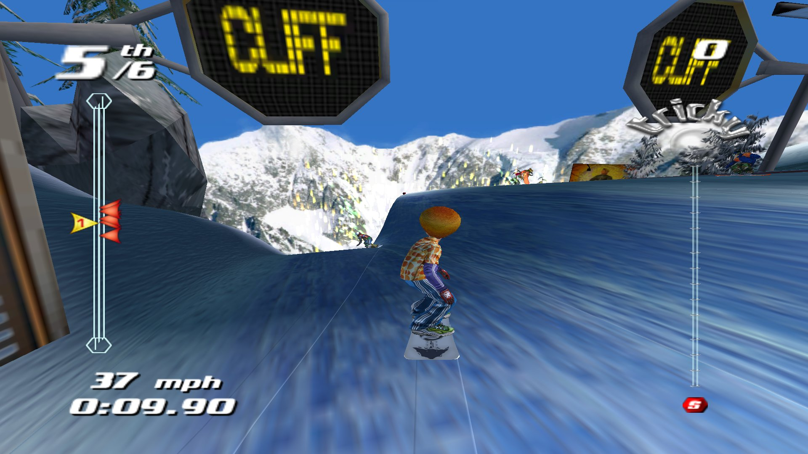
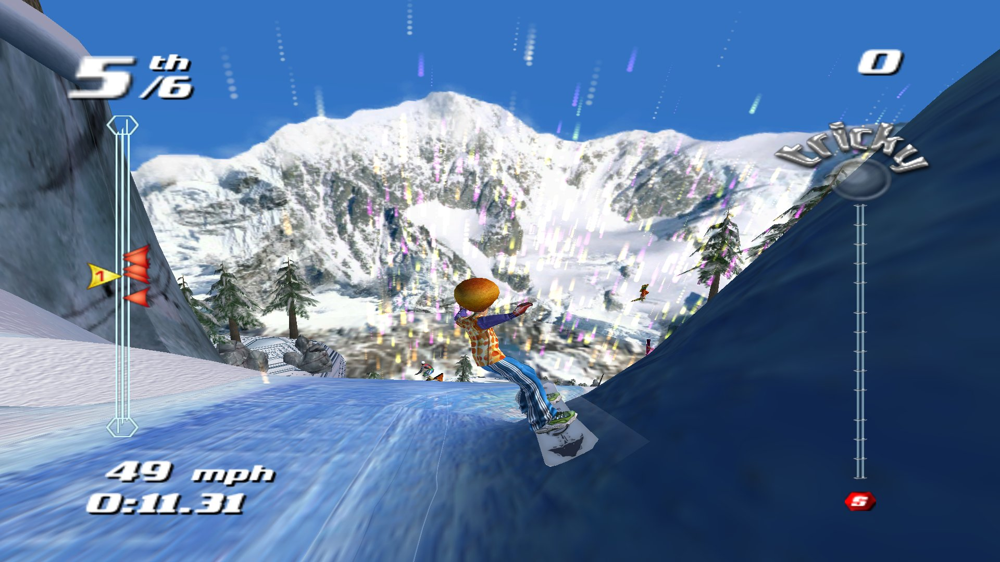
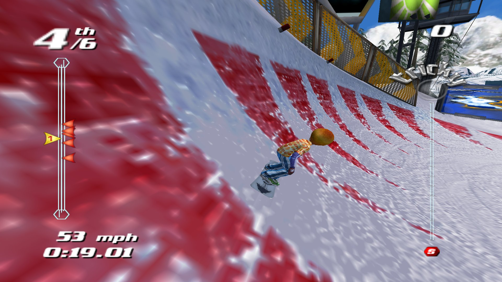
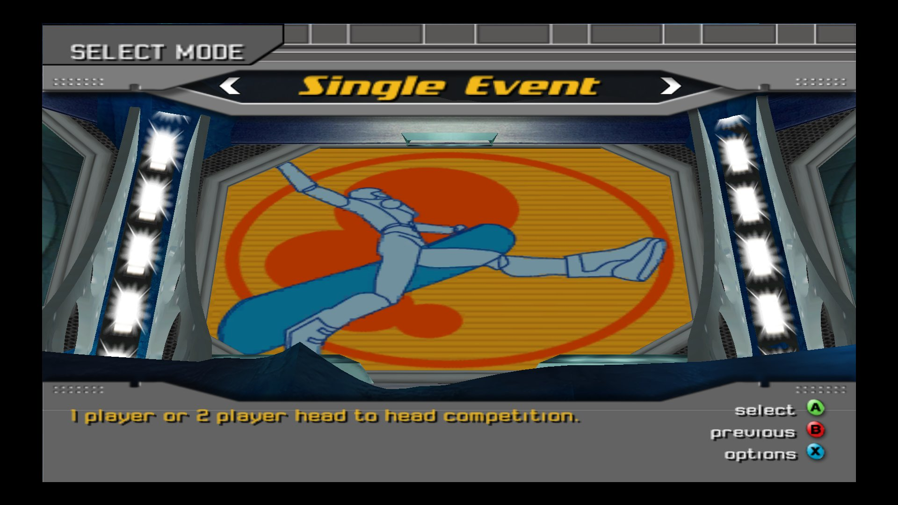
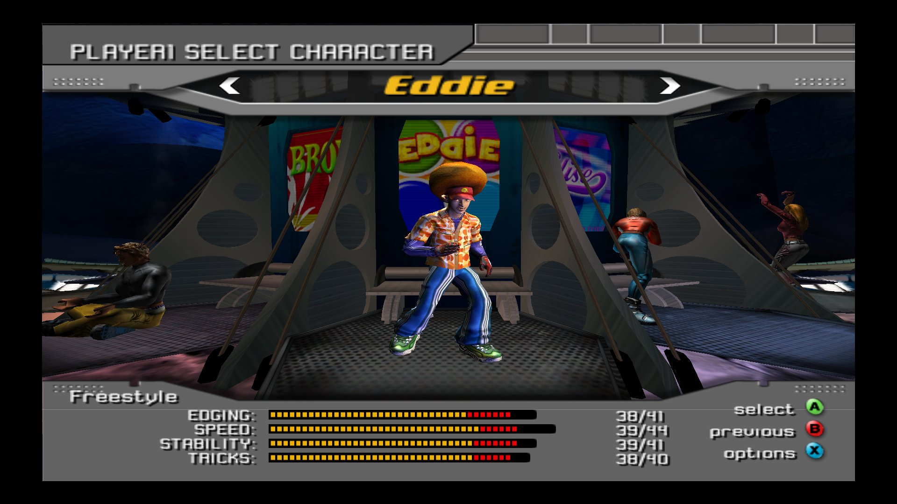

<p align="center">
  
</p>

# SSX Tricky: PC Port

This is a native Windows port of the 2001 Xbox game *SSX Tricky*. It isn't an emulator. The game's own code is translated to C with [xboxrecomp](https://github.com/sp00nznet/xboxrecomp) and built into an ordinary Windows program. It uses Direct3D 11 for graphics, XAudio2 for sound and XInput for controllers.

It also adds:

- **Any resolution**, drawn natively (not stretched from 640×480): 720p, 1080p, 1440p, 4K and the 4:3 sizes, windowed or fullscreen.
- **Real widescreen**: 16:9 switches on SSX Tricky's *own* widescreen mode, the one an Xbox set to widescreen gets, so the game draws a wider view itself.
- **A steady 60 fps** in races.
- **Sharper textures**: full mipmaps, anisotropic filtering (up to 16×) and anti-aliasing (2×, 4×, 8×).
- **A launcher** with Start game and Settings, and a **menu bar** in the game window (screenshots, window size, graphics options, controls, exit).
- **Remappable controls** for the keyboard and for XInput controllers.

> [!IMPORTANT]
> **This repository has no game in it.** It holds no disc image, XBE, game data, audio, movies or translated game code. You need your **own copy of the Xbox game** (the USA release). Make a disc image of it (`.iso`), then point the launcher at that image.

> [!NOTE]
> **This port was made with [Claude Code](https://claude.com/claude-code)**, Anthropic's AI coding assistant. Claude Code wrote most of the port's code, tools and notes, working with the project's human author, who directed, tested and played it. See [Contributors](#contributors).

> [!WARNING]
> **Work in progress.** The game boots, plays its intro movies with sound, runs the whole frontend and races Garibaldi against the AI at 60 fps. Other courses, modes and the finish of a race have not been checked yet. See [Status](#status).

---

## Screenshots

All taken of the port at **1920×1080** with **16:9** switched on. The menus keep their original 4:3 layout; races use the game's own widescreen view.

<table>
  <tr>
    <td width="50%"><br><sub><b>Garibaldi</b>, racing the AI riders</sub></td>
    <td width="50%"><br><sub><b>The halfpipe</b>, with the speed blur</sub></td>
  </tr>
  <tr>
    <td><br><sub><b>Out of the halfpipe</b>, the mountain behind</sub></td>
    <td><br><sub><b>Carving</b> past the course markings</sub></td>
  </tr>
  <tr>
    <td><br><sub><b>Title screen</b></sub></td>
    <td><br><sub><b>Select Mode</b>, the 3D frontend</sub></td>
  </tr>
  <tr>
    <td colspan="2" align="center"><br><sub><b>Character select</b></sub></td>
  </tr>
</table>

---

## Contents

- [Screenshots](#screenshots)
- [What you need](#what-you-need)
- [Install and play](#install-and-play)
- [Controls](#controls)
- [Settings](#settings)
- [Status](#status)
- [Building from source](#building-from-source)
- [Repository layout](#repository-layout)
- [Troubleshooting](#troubleshooting)
- [Contributors](#contributors)
- [Legal and credits](#legal-and-credits)

---

## What you need

| | |
|---|---|
| 💿 **The game** | A disc image of your own *SSX Tricky* **Xbox** disc, **USA** release, as an `.iso`. The launcher checks that it is exactly the build this port was made from. The PS2 and GameCube versions won't work. |
| 🖥️ **PC** | Windows 10 or 11 (64-bit), with a graphics card that supports Direct3D 11. |
| 🎮 **Controller** | Optional. Any XInput (Xbox-style) pad works, and so does the keyboard. |

---

## Install and play

1. **Download** `SSX-Tricky-PC-…-win64.7z` from [**Releases**](https://github.com/MatiasRiveraC/SSX-Tricky-PC/releases/latest) and extract it into its own folder (Windows 11 opens `.7z` files directly; on Windows 10 use [7-Zip](https://www.7-zip.org/)). It holds `SSX Tricky.exe` and `libwinpthread-1.dll`, and no game data. (Or [build it yourself](#building-from-source).)
2. **Make a disc image** of your Xbox game disc, as an `.iso`.
3. **Open `SSX Tricky.exe`**. The launcher opens with **Start game**, **Settings** and **Exit**.
4. In **Settings**:
   1. Under **Disc image**, choose your `.iso`. The launcher reads it (it never changes it) and checks it is the right game and version.
   2. Under **Save folder**, keep the default (`hdd\` beside the exe) or choose another folder. This is the Xbox hard disk: your saves and settings live here.
   3. Pick the **resolution**, **4:3 or 16:9**, **fullscreen**, **textures**, **anti-aliasing** and the other options. The launcher shows recommended values.
5. Press **Start game**. It stays greyed out until a valid disc image is set.

Settings are saved in `SSX Tricky.ini` beside the exe. Screenshots go to `Screenshots\`.

---

## Controls

Everything can be remapped: **Input → Controls…** in the game window's menu, or **Controls…** in the launcher's Settings.

| Xbox button | Controller | Keyboard |
|---|---|---|
| Start | Start | `Enter` |
| Back | Back | `Tab` |
| A / B / X / Y | A / B / X / Y | `Space` / `Esc` / `C` / `V` |
| Black / White | RB / LB | `R` / `F` |
| Left / right trigger | LT / RT | `Q` / `E` |
| Left stick | Left stick | Arrow keys |
| D-pad | D-pad | Arrow keys |
| Right stick | Right stick | (not mapped) |

**In the game window:**

- `Alt+Enter` or `F11` switches between windowed and fullscreen.
- `F12` saves a screenshot.
- The menu bar (hidden in fullscreen) has **Game** (screenshot, open the screenshots or save folder, open the log, exit), **Video** (fullscreen, window size, textures, anti-aliasing, frame rate in the title bar), **Input** (controls) and **Help**.
- Closing the window quits the game.

---

## Settings

| Setting | What it does |
|---|---|
| **Disc image** | Your SSX Tricky (USA) Xbox `.iso`. |
| **Save folder** | The emulated Xbox hard disk: saves, profiles, options. |
| **Resolution** | What the game is drawn at, from 640×480 up to 4K. |
| **Aspect ratio** | **4:3** is the original picture. **16:9** turns on the game's own widescreen mode (it draws a wider view, not a stretched one). |
| **Fullscreen** | Borderless fullscreen. |
| **Textures** | Mipmaps and anisotropic filtering (2×–16×), for sharp textures at a distance and at an angle. |
| **Anti-aliasing** | Smooths edges: off, 2×, 4× or 8×. |
| **Show frame rate** | Frame rate in the window title. |
| **Write a log file** | `SSX Tricky.log` beside the exe, for bug reports. |

There is no language option: the game always uses its American text, and the USA disc only carries that one.

---

## Status

**Works:** boot and save detection, the EA and attract movies with sound, the whole frontend (title, mode, character, event, difficulty and venue select), loading, and a full race on **Garibaldi** with the AI riders, HUD, race clock and speed effects, at 60 fps.

**Known differences from the Xbox** (being worked on):

- **Distant fog is too weak.** Far-away terrain is barely fogged, where the console fades it into the sky colour. Without the fog, ground right at the edge of the view distance can look speckled. This is what makes some surfaces look wrong at a distance and right up close.
- Some particle effects (snow spray, trails) are smaller or dimmer than on the console.
- In the frontend, some lit floors are darker than on the console, and the board is not shown beside the rider on the setup screen.
- Other courses, the other modes, and the end of a race are untested.

The full engineering log is in [`docs/notes/`](docs/notes/): start with `RE_NOTES_INDEX.md` and `RE_NOTES_DECOMP_PROGRESS.md`.

---

## Building from source

The translated game code is **generated on your machine from your own disc**. It isn't stored here. The short version, from an [MSYS2](https://www.msys2.org/) UCRT64 shell with GCC, CMake and Python (`pip install capstone numpy pillow`):

```bash
extract-xiso -x "path/to/SSX Tricky.iso" -d game_files
```

```bash
bash port/tools/regen.sh _local/gen_new
```

```bash
cmake -S port -B port/build -G "MinGW Makefiles" -DCMAKE_BUILD_TYPE=Release
```

```bash
cmake --build port/build -j
```

> [!WARNING]
> `regen.sh` produces the recompiler's base translation. The working tree the port is tested from also has fix-up passes, recovered functions and a few hand-verified bodies that are not yet reproduced by one command. **[docs/building.md](docs/building.md)** explains each step and exactly what is still missing.

---

## Repository layout

| Path | What's there |
|---|---|
| `port/src/` | The PC side: entry point and launch modes, launcher and settings (`launcher.c`), the game window's menu bar (`hostui.c`), control mapping (`controls.c`), XInput for the game's input library (`xapi_input_hle.c`). |
| `port/src/recomp/` | The register model and helpers the translated code is built on (`recomp_types.h`). `gen/` (generated, not in git) goes here. |
| `port/src/seeds.json` | Every function entry point found in the XBE, for the recompiler. Addresses only. |
| `port/tools/` | `regen.sh` (translate your XBE) and `package.sh` (make a shareable folder). |
| `xboxrecomp/` | The static recompiler and Xbox runtime, vendored from [sp00nznet/xboxrecomp](https://github.com/sp00nznet/xboxrecomp) with its history, plus this port's changes: the NV2A → Direct3D 11 renderer, register combiners and vertex programs as shaders, the kernel, timers, audio. |
| `xboxrecomp/tools/audit/` | The tools the port was built and checked with: menu and race regression checks, xemu comparisons, a sampling profiler, recovery and verification of translated functions. See its `README.md`. |
| `docs/notes/` | Reverse-engineering and engineering notes: the game's systems, file formats, and every runtime bug found and how. |
| `docs/reference/xemu_frames/` | Screenshots of the game running on xemu, the reference the renderer is compared against. |

---

## Troubleshooting

- **Start game stays greyed out.** Set a disc image in **Settings**. Only the **USA Xbox** release is supported, and the image must be the full disc.
- **Windows says `libwinpthread-1.dll` is missing.** Keep the DLL from the zip in the same folder as `SSX Tricky.exe`.
- **Windows SmartScreen warns about the exe.** The build isn't code-signed. Choose **More info → Run anyway** if you trust the download.
- **The game closed unexpectedly.** Tick **Write a log file** in Settings, reproduce it, and attach `SSX Tricky.log` when you report the problem.
- **Something is drawn wrong.** Press `F12` for a screenshot and report it with the log, and say where in the game it was.

---

## Contributors

| | Who | What |
|---|---|---|
| 🧑‍💻 | [**MatiasRiveraC**](https://github.com/MatiasRiveraC) | Project lead: direction, testing and playing. |
| 🤖 | [**Claude Code**](https://claude.com/claude-code) (Anthropic) | AI coding assistant: wrote most of the port. That includes the recompiler fixes, the reverse engineering, the Direct3D 11 renderer, the runtime, audio and input, the launcher and menus, the tools and this README. |
| 🛠️ | [**sp00nznet**](https://github.com/sp00nznet) | [xboxrecomp](https://github.com/sp00nznet/xboxrecomp), the static recompiler and runtime this port is built on. Its commit history is kept in this repository. |

> **AI disclosure:** this port was developed with Claude Code. Its commits carry a `Co-Authored-By: Claude` line. Every change was run and tested on the project lead's own PC.

See [CONTRIBUTORS.md](CONTRIBUTORS.md).

---

## Legal and credits

- This is an unofficial fan project. It isn't affiliated with or endorsed by Electronic Arts, EA Canada or Microsoft. *SSX* and *SSX Tricky* belong to Electronic Arts.
- **No game material is included**: no disc image, XBE, data, audio, video or translated game code. You must own the game and supply your own disc image. The screenshots in `docs/` were taken of the port (and, in `docs/reference/`, of the game on xemu); they are used only to show and test the port and belong to the game's owners.
- **Recompiler and runtime**: [xboxrecomp](https://github.com/sp00nznet/xboxrecomp) by sp00nznet, MIT license. See `xboxrecomp/LICENSE`.
- **Pixel shaders**: `xboxrecomp/src/nv2a/nv2a_psh.c` is a port of [xemu](https://xemu.app)'s register-combiner generator (`hw/xbox/nv2a/pgraph/glsl/psh.c`), LGPL-2.1-or-later; see that file's header. xemu was also the reference for how the Xbox GPU behaves.
- **Disassembly**: [Capstone](https://www.capstone-engine.org/). **Reverse engineering**: [Ghidra](https://ghidra-sre.org/).
